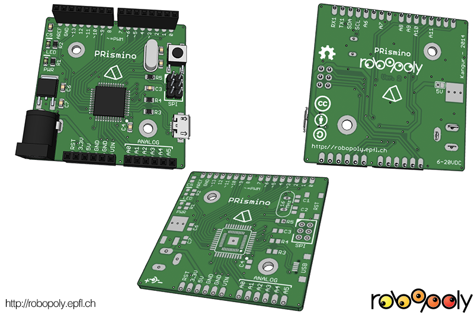
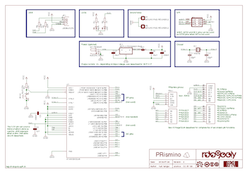
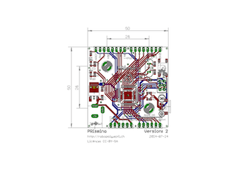

# PRismino

## Introduction

The PRismino is the 3rd generation robotics platform of the [Swiss Federal Institute of Technology in Lausanne, Switzerland](http://www.epfl.ch) robotics club: [Robopoly](http://robopoly.epfl.ch). It's based on the [Arduino Leonardo](http://arduino.cc/en/Main/ArduinoBoardLeonardo) and is made to be easily solderable as new members of the club often use it as their first soldering experience.

### Characteristics

The PRismino uses the same micro-controller as the Arduino Leonardo: the [ATmega32U4](http://www.atmel.com/Images/doc7766.pdf) which features 32KB of flash memory, 2.5KB of SRAM and 1KB of EEPROM. It runs at 16MHz, has 12 10-bit analog inputs and 4 timers: 8-bit, 2 16-bit and one a 10-bit with multiple channels each.

The board size is exactly 50 by 50mm in order to be produced as cost effectively as possible with the [Seeedstudio Fusion](http://www.seeedstudio.com/service/index.php?r=site/pcbService) service. Because of the board size restriction and the awkward Arduino SPI port placement it was not possible to adopt the true Arduino Leonardo pinout, the [Arduino Pro](http://arduino.cc/en/Main/ArduinoBoardPro) pinout was just as good.

Electronic components are bought from [Mouser](http://ch.mouser.com) and the connectors from [4uConnectors](http://www.4uconnector.com).

### The kit

It is intended to be part of a kit named [_Kit PRisme_](http://robopoly.epfl.ch/prisme) comprising of the [Robopoly Shield](https://github.com/Robopoly/Robopoly-Shield), the [Power Board](https://github.com/Robopoly/Power-Board) and various sensors and accessories to build a mobile platform in order to participate at the different [challenges](http://robopoly.epfl.ch/evenements) organised by the robotics club through the academic year.

### The name

The _PRismino_ name comes from _Plateforme Robotique_ in french and _isme_ was added for _PRisme_ as it was easier to pronounce. Then _ino_ was added with the 3rd generation as it became an Arduino (but the Arduino name is copyrighted) and also because _prismino_ means _small prism_ in italian.

## Electrical schematic and PCB

## Assembly

Robopoly members are supposed to solder all components themselves, except for the very difficult ones such as the micro-controller and USB connector which the Robopoly committee takes care of, as such the PRismino is sold disassembled. This is also the reason why the components are so sparely placed on the PCB and the smallest SMD components are of 0805 package.

The assembly of the PRismino is [documented on the Robopoly's website](http://robopoly.epfl.ch/prisme/assemblage).

## Bootloader

Before programming the PRismino has to be loaded with a [bootloader](http://arduino.cc/en/Hacking/Bootloader?from=Main.Bootloader) that allows its program memory to be rewritten via the USB interface. The bootloader has to be loaded in the memory via an [ISP programmer](http://en.wikipedia.org/wiki/In-system_programming). Another Arduino/PRismino board that already has the bootloader can be programmed to act as an ISP programmer with the [Arduino as ISP program](http://arduino.cc/en/Tutorial/ArduinoISP).

A custom bootloader based on the Arduino Leonardo bootloader has been made, it has to be loaded via the stand-alone ISP programmer which can be found in the [Robopoly workroom](http://plan.epfl.ch/?lang=en&room=bm9139).

As the PRismino is 100% compatible with Arduino Leonardo software (as they use the same micro-controller) one can use the same bootloader as there's essentially no difference between the custom and Arduino Leonardo bootloaders.

The project for the [stand-alone ISP programmer](https://github.com/Robopoly/Stand-alone-ISP-Programmer-for-Arduino) for the bootloader uploading has also been published.

## Installing

The install process is the same as [Arduino Leonardo install](http://arduino.cc/en/Guide/ArduinoLeonardo).

## Programming

The programming is done with the [Arduino IDE](http://arduino.cc/en/Main/Software), as PRismino is basically an Arduino it's fully compatible with Arduino libraries. Use the [Arduino programming documentation](http://arduino.cc/en/Reference/HomePage) for reference,

Additionally to the Arduino libraries the [PRismino has its own library](https://github.com/Robopoly/prismino-library) to complement its function set in order to use the [Robopoly Shield](https://github.com/Robopoly/Robopoly-Shield) effectively.

In order to use the PRismino library they have to be downloaded and copied to the respective folders (which varies with the operating system), see the [official guide](http://arduino.cc/en/Guide/Libraries) on how to add libraries to Arduino IDE.

### Atmel Studio

Programming can also be done with Atmel Studio, the official tool to program AVR micro-controllers (Windows only), to set up the programming environment for Arduino boards on Atmel Studio [follow these instructions](http://robopoly.epfl.ch/prisme/tutoriels/atmelstudio). It has the main advantage of being capable of simulating the code, compiling without including Arduino libraries and programming in [Assembly](http://en.wikipedia.org/wiki/Assembly_language).

## Timer usage

* **Timer0**: 8-bit timer, used by Arduino for such functions as `delay()`, `millis()` and `micros()`.
* **Timer1**: 16-bit timer, used by Arduino for the Servo library.
* **Timer2**: not available on ATmega32U4.
* **Timer3**: 16-bit timer, shares the same prescaler as timer1, used for Arduino `tone()` function.
* **Timer4**: 10-bit timer, used for the H-bridge on the [shield](https://github.com/Robopoly/Robopoly-Shield).

One can override the timer functions, but the original functions won't be usable or work as intended if timer configurations are changed.

## Pinout

You may use this diagram for reference, but note that the PRsimino is not an exact copy of Arduino Leonardo and not all elements are present or in the same place on the PRismino board.

### Low-level programming

To manage pins more efficiently, instead of using the Arduino `digitalRead()` and `digitalWrite()` functions which add quite some overhead you may toggle the respective registers directly.

For example to toggle the LED pin which is on the pin 13, but physically on the pin 7 of port C (`PC7`) you can use:

    // set pin as output by setting the DDR (Data Direction Register) of the corresponding pin to 1 (output)
    DDRC |= (1 << 7);
    // set pin value to 1 (logical high) to turn the LED on
    PORTC |= (1 << 7);
    // set pin value to 0 (logical low) to turn the LED off
    PORTC &= ~(1 << 7);

## Component list

| Component                            | Reference     | Quantity |
| ------------------------------------ | ------------- | ---------|
| PCB                                  |               | 1        |
| Micro-controller                     | ATMEGA32U4-AU | 1        |
| Oscillator (16MHz)                   |               | 1        |
| 22pF 0805 capacitor for oscillator   |               | 2        |
| 100nF, 20V min, 0805 capacitor       |               | 2        |
| 10uF, 20V min, 0805 capacitor        |               | 2        |
| Micro USB B female plug              | 4UCON-20013   | 1        |
| 22ohm 0805 resistor for USB          |               | 2        |
| SMD LED 0805                         |               | 2        |
| 1K 0805 resistor for LED             |               | 2        |
| Button                               |               | 1        |
| 10K 0805 resistor for button         |               | 1        |
| 6 female pins                        | 4UCON-00527   | 2        |
| 8 female pins                        | 4UCON-00531   | 2        |
| Male USB A to male micro USB B cable |               | 1        |
| 1uF 0805 UCAP capacitor              |               | 1        |
| DC Plug                              |               | 1        |
| 5V regulator                         |               | 1        |
| 2x3 male pins (SPI)                  | 4UCON-00989   | 1        |

There are two types of footprints for the micro-controller on the PCB, the QFN is small enough to fit inside the TQFP footprint

## CAD files

The CAD file is in [Google Sketchup](http://www.sketchup.com) format. Generated with [eagleUp](http://eagleup.wordpress.com/), a plugin that exports the board from [Eagle CAD](http://www.cadsoftusa.com) and imports it to Google Sketchup.

All additional files needed to generate the board are in the [Robopoly Eagle CAD library and SketchUp files](https://github.com/Robopoly/Robopoly-Eagle-library) project.

## Version log

### 2.0 (2014-02-05)

* Removed resistor `R1`. Originally needed to launch the bootloader after the reset button is clicked, but the `BOOTRST` fuse bit takes care of that.
* Reordered component numbering. After `R1` was removed component numbering had to be reordered. The passive elements were also ordered in the order in which they should be soldered.
* Moved default oscillator frequency silkscreen markings under the oscillator as one could solder an oscillator with a different frequency (8MHz to work at 3.3V for example) and the silkscreen would be wrong then.
* Modified some silkscreen text, updated version number and year.
* Routed USB data lines closer to each other.
* Made PCB corners round.
* Updated CAD and Gerber files.
* Added component list.

### 1.0 (2013-07-08)

* Initial version.

## Licence

The PRismino is published under [Creative Commons Attribution Share-Alike license](http://creativecommons.org/licenses/by-sa/3.0/).

